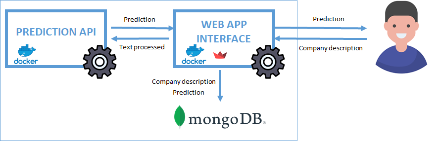

Project Structure:

API:

Contains the code for the API component, primarily responsible for making predictions.

App:

Houses the web application code developed using the Streamlit library. This component is dedicated to the user interface and 
input text preprocessing.

Deployment:

This directory holds deployment configurations and scripts for the project.

Notebooks:

Contains Jupyter notebooks for data analysis and modeling purposes.

Infrastructure

