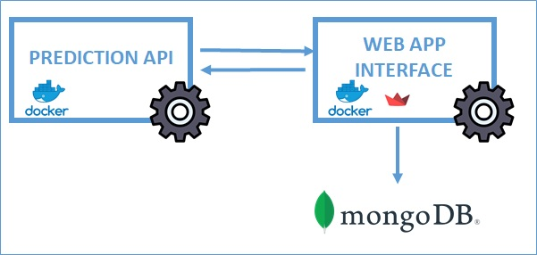

This GitHub project consists of several components:

api: This directory contains the code for the API component of the project, used basically to perform the predictions
app: Inside this is the app web code, which was dveloped using Streamlit libreary
deployment: 
notebooks: This directory houses Jupyter notebooks related to the project, which include data analysis and modeling. 

Infrastructure

